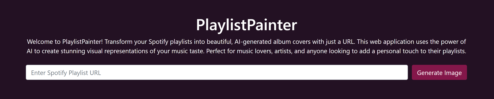
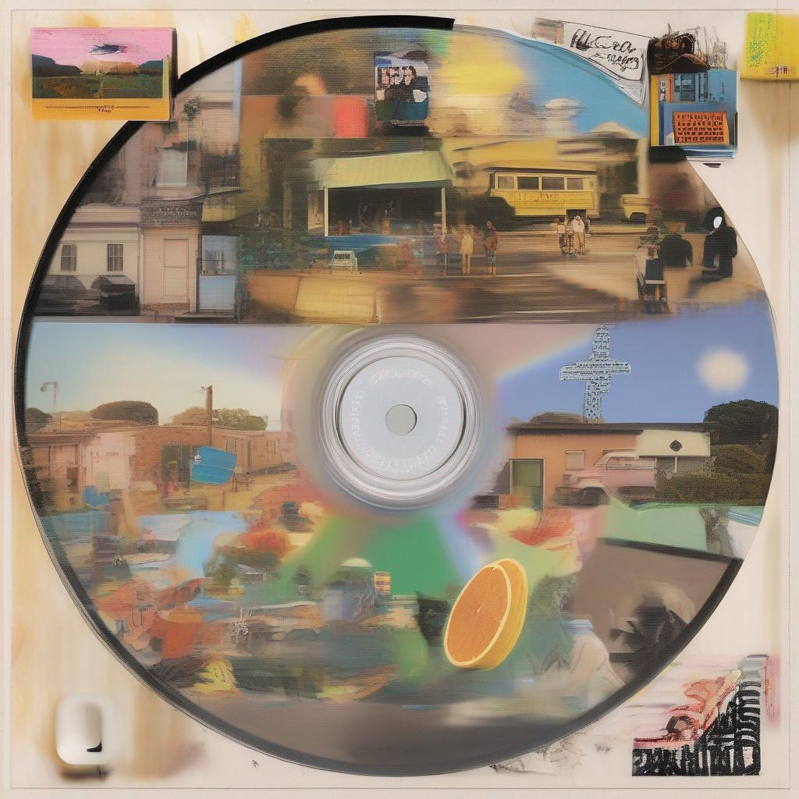
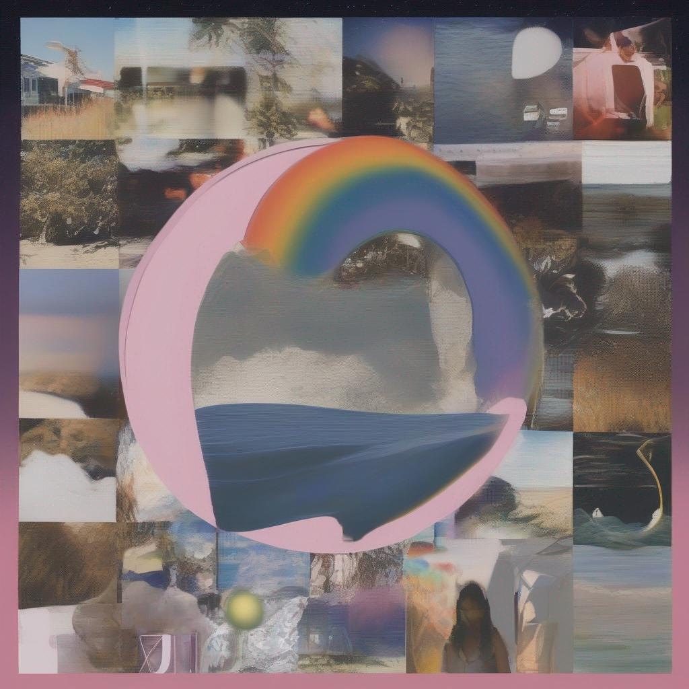
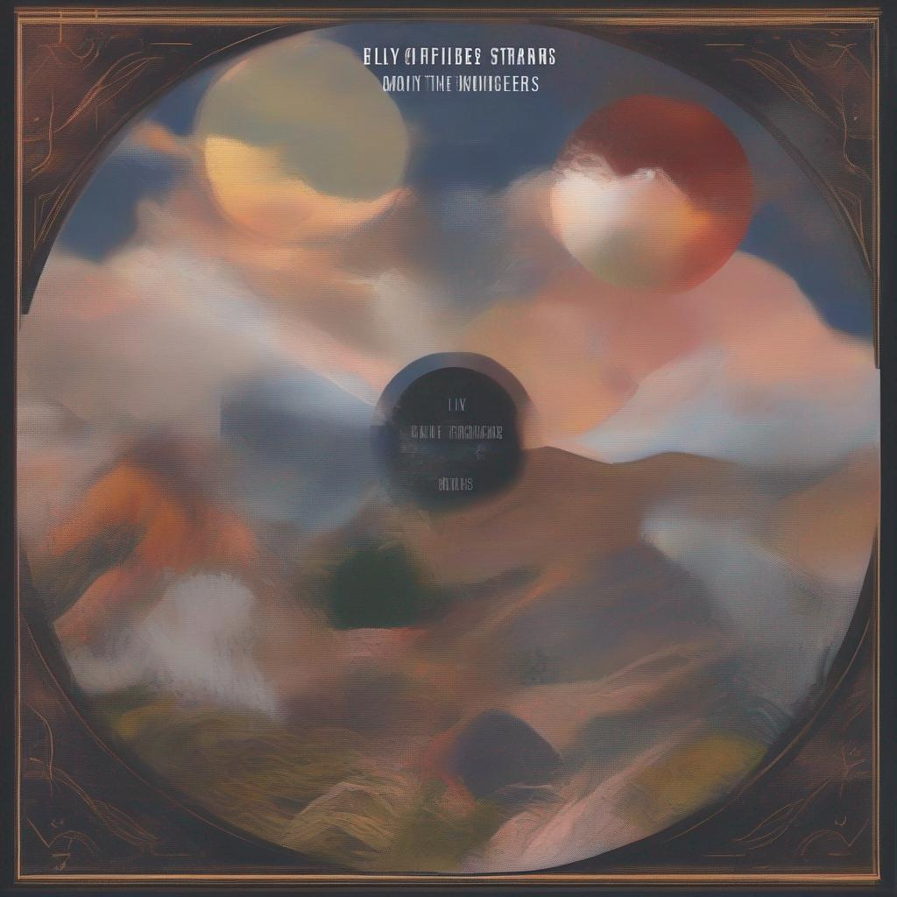
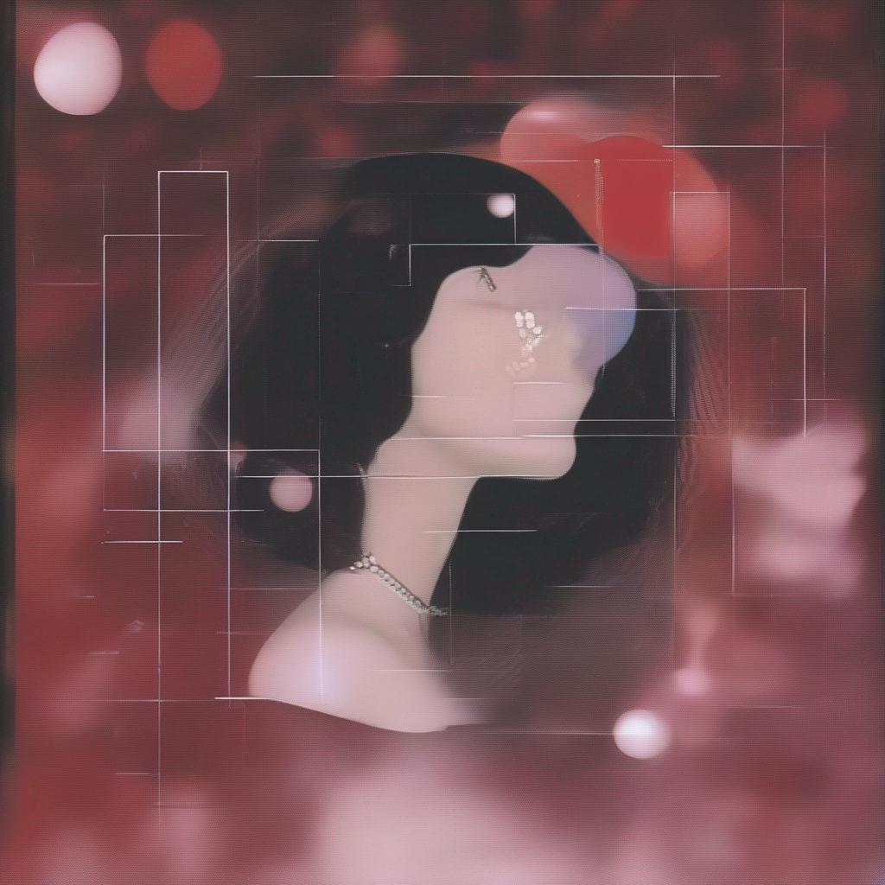

# 🎨 PlaylistPainter

Transform your Spotify playlists into beautiful, AI-generated album covers with **PlaylistPainter**! This web application uses the power of AI to create stunning visual representations of your music taste.

## Features

- **Spotify Integration**: Generate images from any Spotify playlist URL.
- **AI-Powered**: Utilizes advanced AI models to create unique and beautiful album covers.
- **Mobile-Optimized**: Fully responsive design for mobile devices.
- **Downloadable Images**: Easily download your generated images.
- **Playlist Song List**: View the songs in your playlist in a sleek, multi-column layout.

## Usage

1. **Enter Spotify Playlist URL**: Paste your Spotify playlist URL into the input field.
2. **Generate Image**: Click the "Generate Image" button to create a unique album cover.
3. **Download Image**: Once the image is generated, click the "Download Image" button to save it.
4. **View Songs**: Scroll down to see the songs in your playlist displayed in a beautiful, multi-column layout.

## Screenshots

*Description: The main interface of PlaylistPainter.*

*Description: Example of a generated image from a Spotify playlist.*

## Technologies Used

- **Flask**: Flask is a lightweight WSGI web application framework in Python. It is designed with simplicity and flexibility in mind, making it a great choice for small to medium web applications. Flask allows developers to create a robust back-end to handle requests and serve responses efficiently.
  
- **Bootstrap**: Bootstrap is a popular front-end framework for developing responsive and mobile-first websites. It provides a collection of CSS and JavaScript tools to create a consistent and attractive user interface. In PlaylistPainter, Bootstrap is used to ensure the application looks great on all devices and screen sizes.

- **Hugging Face**: Hugging Face provides a wide array of AI models that can be used for natural language processing and other AI tasks. PlaylistPainter leverages the Hugging Face API and model 'CiroN2022/cd-md-music' to generate images based on the titles of the songs in the playlist, creating unique and visually appealing album covers.

- **PIL (Pillow)**: Pillow is a powerful image processing library in Python. It allows for opening, manipulating, and saving many different image file formats. In PlaylistPainter, Pillow is used to process the images generated by the AI, convert them into a format suitable for display on the web, and enable the download functionality.

## License

This project is licensed under the MIT License. See the [LICENSE](LICENSE) file for more details.

## Contact

If you have any questions, feel free to reach out:

- Email: aeburton3@crimson.ua.edu
- GitHub: [ellie-burton](https://github.com/ellie-burton)

---

Enjoy creating beautiful album covers with **PlaylistPainter**! 🎨🎶
